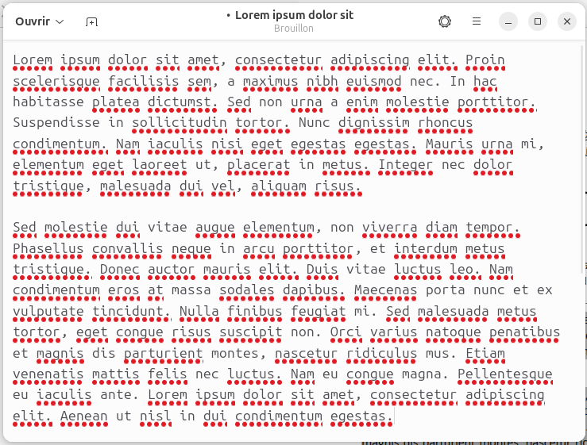
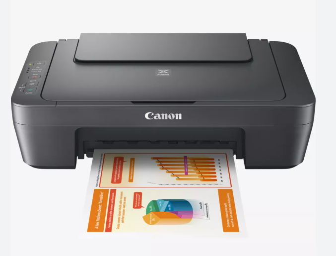
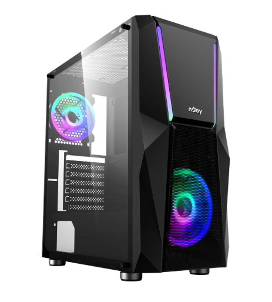
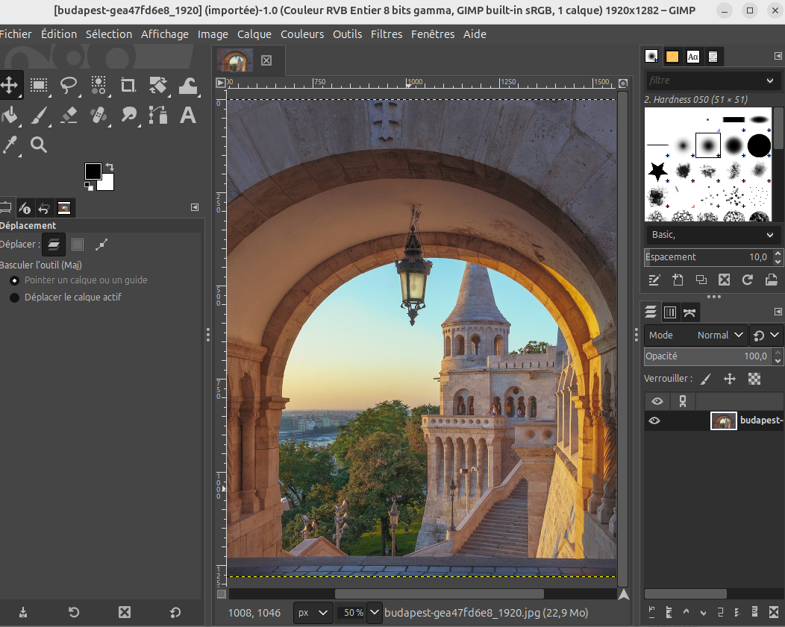

<!--
_footer: ""
_paginate: skip
-->

# Distinguer logiciel et matériel

---

# Nommez et décrivez les éléments qui suivent...

<!-- bla bla-->

---

<!--  -->
---

<!--  -->

---

<!--  -->
---

<!--  -->

---

<!--  -->

---

<!--  -->

---

<!--  -->

---

# En pratique...

---

# Travail de groupe

---

# Classer les cartes en 2 catégories

## 1. Les éléments qu'on peut toucher (les éléments physiques)
## 2. Les éléments qu’on ne peut pas toucher (les éléments immatériels).

---

# Définition hardware

## En informatique, le hardware (matériel) désigne l’ensemble des éléments physiques (qu’on peut toucher et manipuler) qui forment un ordinateur, ou y-sont reliés.

---

# Définition software

## En informatique, le software (logiciel) désigne l’ensemble des programmes (qu’on ne peut pas toucher) qui permettent à un ordinateur de fonctionner et d’exécuter des tâches.

<!-- END -->